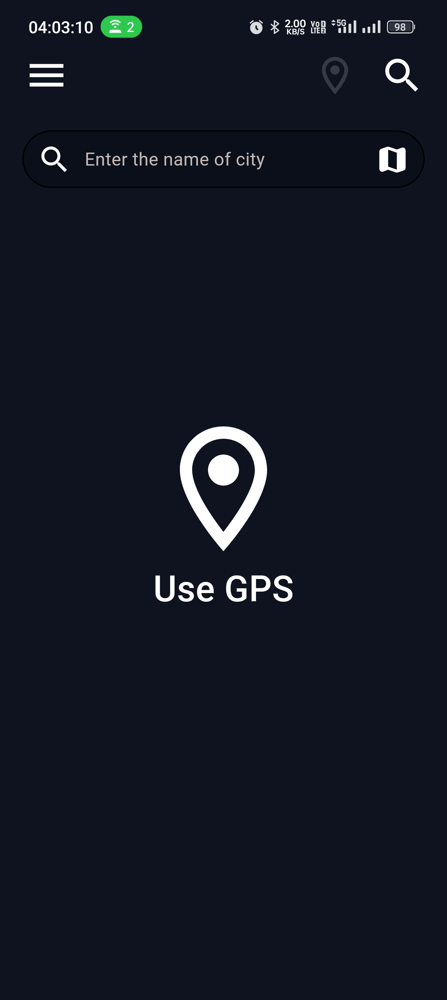
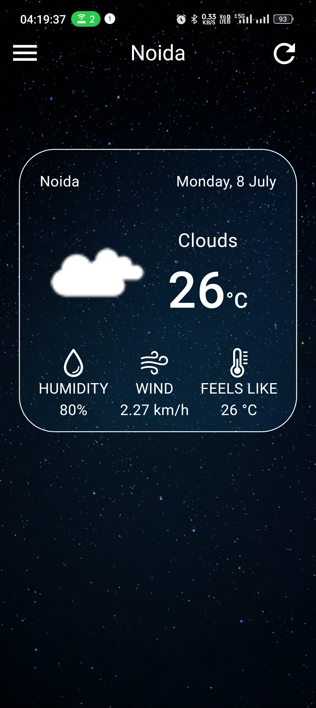

   
   <h2>SkyGuru</h2>
   
a material design, <strong>open source live-weather app</strong> for android with <strong>Material You</strong> theming.

## Prerequisites:
- Install Flutter: Ensure you have Flutter SDK installed on your machine. You can download it from the official Flutter website.

- Set up Flutter Environment: Set up your development environment by configuring Flutter SDK path in your system's PATH variable. This is essential for running Flutter commands globally.

- Install Flutter and Dart Plugin: If you are using an IDE like Android Studio or VS Code, install the Flutter and Dart plugins to enable Flutter development in your chosen IDE.

## Steps to run the app:

-  clone the repo using git clone https://github.com/shadowjynxs/flutter_skyguru.git
-  cd flutter_skyguru
-  run 'flutter pub get' and then 'flutter run' to run on android device 

## General Information:

-  This is open source project using OpenWeatherApi

## Screenshots:

#### Mobile-

|  |  |  |  |
| ----------------------------------------------------------- | --------------------------------------------------------------- | ---------------------------------------------------------------------- | ------------------------------------------------------------ |

---
https://github.com/shadowjynxs/flutter_skyguru/assets/54329604/da47e81c-7253-43b5-9351-f05540d117ad

